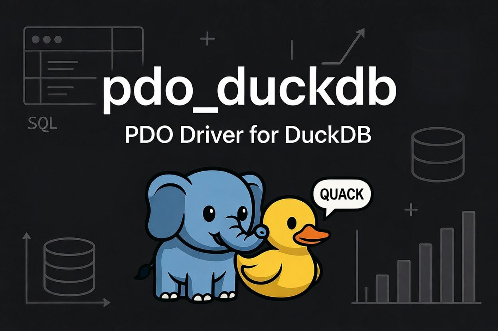

# pdo_duckdb

[](https://github.com/iliaal/pdo_duckdb/actions/workflows/tests.yml)
[](https://github.com/iliaal/pdo_duckdb/releases)
[](LICENSE)
[](https://x.com/intent/follow?screen_name=iliaa)



A [PDO](https://www.php.net/pdo) driver for [DuckDB](https://duckdb.org/), the
in-process analytical (OLAP) database. Connect to DuckDB through the standard
PDO API you already use for SQLite, MySQL, and PostgreSQL.

```php
$db = new PDO('duckdb:/path/to/analytics.duckdb');
$db->setAttribute(PDO::ATTR_ERRMODE, PDO::ERRMODE_EXCEPTION);

$stmt = $db->prepare('SELECT region, SUM(amount) AS total FROM sales WHERE year = ? GROUP BY region');
$stmt->execute([2026]);
foreach ($stmt as $row) {
    printf("%s: %s\n", $row['region'], $row['total']);
}
```

## Requirements

- PHP 8.1 or newer with the `pdo` extension
- For a source build only: DuckDB 1.5.3 or newer (`libduckdb` + `duckdb.h`),
  available as a prebuilt bundle from the [DuckDB installation page](https://duckdb.org/docs/installation/)
  or via your package manager. Prebuilt installs (below) need nothing else.

## 🚀 Installation

### PIE

```sh
pie install iliaal/pdo_duckdb
```

On Linux (x86_64/arm64), macOS (Apple Silicon), and Windows x64, PIE downloads a
self-contained prebuilt binary. No DuckDB install or build toolchain needed. On
Linux the prebuilt baseline is glibc 2.36 (Debian 12); Apple Silicon binaries
target macOS 11.0. On other platforms, older operating systems, or older PHP,
use a source build, which needs
`libduckdb` + `duckdb.h`; point it at the prefix if they aren't in a standard
location:

```sh
pie install iliaal/pdo_duckdb --with-pdo-duckdb=/opt/duckdb
```

### From source

```sh
phpize
./configure --with-pdo-duckdb=/opt/duckdb
make
make install
```

Then enable it in `php.ini` (after `pdo`):

```ini
extension=pdo_duckdb
```

## DSN

```
duckdb:/path/to/database.duckdb   # file-backed database
duckdb::memory:                   # in-memory database
duckdb:                           # in-memory database (empty path)
```

### Connection options

Append DuckDB configuration as `;key=value` pairs on the DSN, or pass them as a
`PDO::DUCKDB_ATTR_CONFIG` array:

```php
// open a database read-only, with a memory cap
$db = new PDO('duckdb:/data/analytics.duckdb;access_mode=read_only;memory_limit=2GB');

// equivalent, via the options array
$db = new PDO('duckdb::memory:', null, null, [
    PDO::DUCKDB_ATTR_CONFIG => ['threads' => 4, 'memory_limit' => '2GB'],
]);
```

Any DuckDB setting name works (`access_mode`, `memory_limit`, `threads`, ...);
an unknown option fails the connection. `PDO::DUCKDB_ATTR_CONFIG` is connect-time
only and is refused with persistent handles, because PDO's persistent key does
not include driver option arrays.

Persistent connections reuse the same DuckDB connection for a matching DSN.
DuckDB session/catalog state such as temporary tables, `SET` options, attachments,
and `:memory:` contents can therefore survive across requests in the same PHP
process; do not use persistence as a tenant or request isolation boundary.

When `open_basedir` is set, external file access stays disabled whatever you
pass. The driver also rejects path/security-sensitive DuckDB settings such as
`allowed_directories`, `allowed_paths`, `allowed_configs`, `temp_directory`,
`extension_directory`, and extension auto-install/load knobs, and locks DuckDB
configuration after the sandbox profile is applied. The database-file path check and DuckDB's open are
separate filesystem operations because DuckDB has no descriptor-based open API.
For file-backed databases, keep every writable path component below trusted,
non-writable directory ancestry so an attacker cannot replace a checked path by
renaming a file or symlink before DuckDB opens it.

## 🛠️ Bulk insert (Appender)

For fast bulk loads, `PDO::duckdbAppender()` returns a `Pdo\Duckdb\Appender`
wrapping DuckDB's native appender, far faster than row-by-row `INSERT`:

```php
$db->exec('CREATE TABLE events (id INTEGER, name VARCHAR, ts TIMESTAMP)');

$app = $db->duckdbAppender('events');      // optional 2nd arg: schema name
foreach ($rows as $r) {
    $app->appendRow($r['id'], $r['name'], $r['ts']);
}
$app->flush();   // push buffered rows; appender stays open for more rows
$app->close();   // flush + finalize; further append/flush/close throw
```

`flush()` commits buffered rows and leaves the appender usable. `close()`
flushes, finalizes the native appender, and marks the PHP object closed. Relying
on the destructor alone still closes (and warns on failure); prefer an explicit
`close()`. Soft validation failures (`ValueError`/`TypeError` for arity, types,
ranges) leave the appender live so you can retry the row. Hard DuckDB failures
on append/flush/close poison the appender — later use throws `Error` and you must
create a new one.

`appendRow(...$values)` takes one argument per column (left to right) and
returns the appender for chaining. PHP `null`/`bool`/`int`/`float`/`string` map
to DuckDB values; DuckDB casts them to the target column types. For nested
columns, pass a PHP array: a list fills `LIST`/`ARRAY`, and an associative array
fills `STRUCT` (by field name) or `MAP`.

```php
$db->exec('CREATE TABLE t (tags VARCHAR[], attrs STRUCT(x INTEGER, y VARCHAR))');
$app = $db->duckdbAppender('t');
$app->appendRow(['php', 'duckdb'], ['x' => 1, 'y' => 'hi']);
$app->flush();
```

Pass a column list as the third argument to append only some columns; the rest
take their `DEFAULT` (or `NULL`). Handy for tables with generated keys or
timestamps:

```php
$db->exec("CREATE TABLE events (id BIGINT DEFAULT nextval('seq'), ts TIMESTAMP DEFAULT now(), payload VARCHAR)");
$app = $db->duckdbAppender('events', null, ['payload']);
$app->appendRow('hello')->appendRow('world');   // id and ts fill themselves
$app->flush();
```

On PHP 8.4+, `PDO::connect('duckdb:…')` returns a `Pdo\Duckdb` instance and
`duckdbAppender()` lives on that subclass. On `new PDO('duckdb:…')` (and on PHP
8.1-8.3) the method is available on the PDO object directly; note PHP 8.5 emits a
deprecation for driver methods called on the base `PDO` class, so prefer
`PDO::connect()` on 8.4+.

## 🔍 Query helpers

Two driver-specific methods, available on the same object as `duckdbAppender()`:

```php
// Tables a query references, resolved by DuckDB's parser (read queries only;
// DML returns []). Pass true to include a non-default schema.
$db->duckdbTableNames('SELECT * FROM users u JOIN s.orders o ON u.id = o.id');
// ['orders', 'users']
$db->duckdbTableNames('SELECT * FROM s.orders', true);   // ['s.orders']

// Profiling tree of the last executed query. Enable profiling first; the method
// reads the recorded profile and runs nothing itself. Returns null until then.
$db->exec("PRAGMA enable_profiling='no_output'");
$db->query('SELECT count(*) FROM events WHERE ts > now() - INTERVAL 1 DAY');
$profile = $db->duckdbLastProfile();
// ['metrics' => ['QUERY_NAME' => '…', 'LATENCY' => '0.004', …],
//  'children' => [ ['metrics' => ['OPERATOR_NAME' => 'SEQ_SCAN', …], 'children' => […]] ]]
```

Profiling metric values are strings; cast the numeric ones as needed.

## 🧩 DuckDB extensions

DuckDB extensions load through ordinary SQL, no special API:

```php
$db->exec('LOAD json');                     // bundled extensions load offline
$db->exec('INSTALL httpfs; LOAD httpfs;');  // downloadable extensions
```

## Usage notes

- **Placeholders.** Positional `?` and named `:name` placeholders are supported;
  PDO rewrites them to DuckDB `$N` parameters. A repeated `:name` is bound once.
  Because `:` is reserved for placeholders, inline `STRUCT`/`MAP` literals must
  keep a space after the colon (`{'k': 1}`, not `{'k':1}`) in prepared queries.
- **Transactions.** `beginTransaction()` / `commit()` / `rollBack()` map to
  DuckDB `BEGIN TRANSACTION` / `COMMIT` / `ROLLBACK`. DuckDB is
  autocommit-by-default with no session toggle, so `setAttribute(PDO::ATTR_AUTOCOMMIT,
  false)` is rejected; use `beginTransaction()` for explicit transactions. The
  driver also reflects raw transaction-control SQL through `inTransaction()` so
  persistent handles cannot retain an invisible transaction after PHP releases
  a PDO object. This includes DuckDB's `END` and `ABORT` aliases and transaction
  control wrapped by `EXPLAIN ANALYZE`; DuckDB reports only the outer `EXPLAIN`
  statement type, so the driver tracks the wrapped effect explicitly after
  successful execution.
- **`open_basedir`.** When `open_basedir` is set, DuckDB's SQL-level external
  file access (`read_csv`, `COPY`, `ATTACH`, `httpfs`, …) is disabled so the
  sandbox holds at the SQL layer, not just for the database file path. If
  `open_basedir` is tightened after a handle already exists, the driver clears
  DuckDB path allowlists before disabling external access and locks the
  connection configuration. You can still activate an extension compiled into
  DuckDB, such as `LOAD json`; the sandbox blocks extension files and downloads.
- **`lastInsertId()`** is not supported; DuckDB has no implicit rowid. Use a
  sequence and `currval()` if you need generated keys.
- **Type mapping.** Integers up to 64-bit signed return as `int`, `FLOAT`/`DOUBLE`
  as `float`, `BLOB` as a binary string, and everything else (`VARCHAR`,
  `DATE`/`TIME`/`TIMESTAMP`, `DECIMAL`, `HUGEINT`/`UBIGINT`, nested types) as its
  canonical string form. `getColumnMeta()` reports the real DuckDB type name per
  column, plus `precision`/`scale` for `DECIMAL`. Nested values with boolean,
  integer, `DECIMAL`, `DATE`, and `UUID` leaves use a direct renderer; nested
  values whose leaves need DuckDB's quoting rules keep DuckDB's own renderer.
  Nested fetches intentionally return canonical strings, not PHP arrays; use SQL
  projections such as `unnest`, `struct_extract`, or `json` when you want a
  different PHP-facing shape.
  `GEOMETRY` (from the spatial extension) returns its WKB bytes as a hex string;
  call `ST_AsText()` in SQL if you want WKT. `TIMESTAMPTZ` native fetches render
  the instant in UTC (`+00`); select `CAST(col AS VARCHAR)` if you need DuckDB's
  session-`TimeZone` rendering. DuckDB's C result API cannot extract non-NULL
  `VARIANT` cells safely, so fetching one reports a PDO error; cast it to
  `VARCHAR` (or another concrete SQL type) in the query. SQL NULL remains PHP
  `null`.
- **Streaming results.** By default `execute()` returns a materialized result:
  DuckDB buffers the full result set before PDO fetches, so a large `SELECT` is
  bounded by available memory. For large scans, set `PDO::DUCKDB_ATTR_UNBUFFERED`
  to fetch chunks lazily through DuckDB's pending-result API instead:

  ```php
  $db->setAttribute(PDO::DUCKDB_ATTR_UNBUFFERED, true);
  ```

  The driver does not add a one-active-stream guard. With the tested DuckDB C API,
  another statement can run while an unbuffered result is partially consumed, and
  the first result can continue afterward. Use `PDOStatement::closeCursor()` when
  you want to release the native result early.

  Persistent connections reset `DUCKDB_ATTR_UNBUFFERED` to false on every checkout
  (`check_liveness`). Pass it again in the constructor options or call
  `setAttribute` after each `new PDO(..., [PDO::ATTR_PERSISTENT => true])`.

## Status

Early release. Result columns are decoded with DuckDB's data-chunk/vector API:
native scalars go straight to PHP values, nested and extended types via their
canonical string form.

## 🔗 Native PHP extensions

Companion native PHP extensions:

- **[php_excel](https://github.com/iliaal/php_excel)**: native Excel I/O via LibXL. 7-10× faster than PhpSpreadsheet, full XLS/XLSX with formulas, formatting, and styling.
- **[mdparser](https://github.com/iliaal/mdparser)**: native CommonMark + GFM markdown parser via md4c. 15-30× faster than pure-PHP libraries.
- **[php_clickhouse](https://github.com/iliaal/php_clickhouse)**: native ClickHouse client speaking the wire protocol directly. Picks up where SeasClick left off.
- **[fastjson](https://github.com/iliaal/fastjson)**: drop-in faster `ext/json`, backed by yyjson. 6× encode, 2.7× decode, 5× validate.
- **[phpser](https://github.com/iliaal/phpser)**: decoder-optimized binary serializer for cache workloads. Faster than igbinary on packed numerics and DTO batches.
- **[fast_uuid](https://github.com/iliaal/fast_uuid)**: high-throughput UUID generation (v1/v4/v7), batched CSPRNG and SIMD hex formatter, ramsey-compatible API.
- **[fastchart](https://github.com/iliaal/fastchart)**: native chart-rendering extension. 38 chart types behind one fluent OO API, SVG-canonical with PNG/JPG/WebP and optional PDF output.
- **[statgrab](https://github.com/iliaal/statgrab)**: system statistics (CPU, memory, disk, network) via libstatgrab, no parsing /proc by hand.
- **[phonetic](https://github.com/iliaal/phonetic)**: native phonetic name matching (Double Metaphone, Beider-Morse, Daitch-Mokotoff, NYSIIS, Match Rating), the encoders PHP core lacks.

## License

BSD 3-Clause. See [LICENSE](LICENSE).

---

[Follow @iliaa on X](https://x.com/iliaa) • [Blog](https://ilia.ws) • If this got DuckDB into your PHP stack, ⭐ star it!
