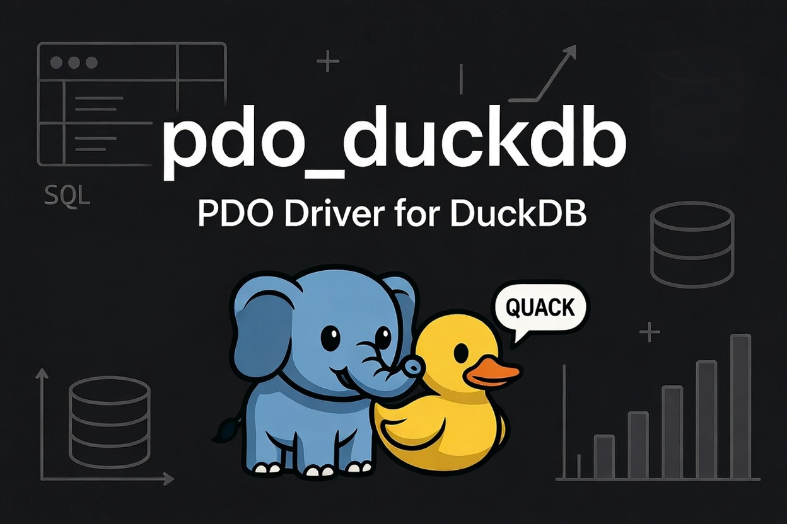

# pdo_duckdb

[](https://github.com/iliaal/pdo_duckdb/actions/workflows/tests.yml)
[](https://github.com/iliaal/pdo_duckdb/releases)
[](LICENSE)
[](https://x.com/intent/follow?screen_name=iliaa)



A [PDO](https://www.php.net/pdo) driver for [DuckDB](https://duckdb.org/), the
in-process analytical (OLAP) database. Connect to DuckDB through the standard
PDO API you already use for SQLite, MySQL, and PostgreSQL.

```php
$db = new PDO('duckdb:/path/to/analytics.duckdb');
$db->setAttribute(PDO::ATTR_ERRMODE, PDO::ERRMODE_EXCEPTION);

$stmt = $db->prepare('SELECT region, SUM(amount) AS total FROM sales WHERE year = ? GROUP BY region');
$stmt->execute([2026]);
foreach ($stmt as $row) {
    printf("%s: %s\n", $row['region'], $row['total']);
}
```

## Requirements

- PHP 8.1 or newer with the `pdo` extension
- For a source build only: DuckDB 1.5.3 or newer (`libduckdb` + `duckdb.h`),
  available as a prebuilt bundle from the [DuckDB installation page](https://duckdb.org/docs/installation/)
  or via your package manager. Prebuilt installs (below) need nothing else.

## 🚀 Installation

### PIE

```sh
pie install iliaal/pdo_duckdb
```

On Linux (x86_64/arm64), macOS (Apple Silicon), and Windows x64, PIE downloads a
self-contained prebuilt binary. No DuckDB install or build toolchain needed. On
Linux the prebuilt baseline is glibc 2.36 (Debian 12); Apple Silicon binaries
target macOS 11.0. On other platforms, older operating systems, or older PHP,
PIE falls back to a source build, which needs `libduckdb` + `duckdb.h`. If
they aren't in a standard location, point it at the prefix:

```sh
pie install iliaal/pdo_duckdb --with-pdo-duckdb=/opt/duckdb
```

### From source

```sh
phpize
./configure --with-pdo-duckdb=/opt/duckdb
make
make install
```

Then enable it in `php.ini` (after `pdo`):

```ini
extension=pdo_duckdb
```

## DSN

```
duckdb:/path/to/database.duckdb   # file-backed database
duckdb::memory:                   # in-memory database
duckdb:                           # in-memory database (empty path)
```
Only the exact path `:memory:` (or an empty path) opens an in-memory database.
Anything else is a file path, including `:memory:foo`, which creates a file
named `:memory:foo`. For a named in-memory database, attach one in SQL:
`ATTACH ':memory:' AS name`.

### Connection options

Append DuckDB configuration as `;key=value` pairs on the DSN, or pass them as a
`PDO::DUCKDB_ATTR_CONFIG` array:

```php
// open a database read-only, with a memory cap
$db = new PDO('duckdb:/data/analytics.duckdb;access_mode=read_only;memory_limit=2GB');

// equivalent, via the options array
$db = new PDO('duckdb::memory:', null, null, [
    PDO::DUCKDB_ATTR_CONFIG => ['threads' => 4, 'memory_limit' => '2GB'],
]);
```

Any DuckDB setting name works (`access_mode`, `memory_limit`, `threads`, ...);
an unknown option fails the connection. `force_mbedtls_unsafe` is rejected at
connect time because libduckdb 1.5.3-1.5.5 crashes on a falsy value before the
database exists; if you need it, `SET` it after open.
`PDO::DUCKDB_ATTR_CONFIG` is connect-time only and is refused with persistent
handles, because PDO's persistent key doesn't include driver option arrays.

Persistent connections reuse the same DuckDB connection for a matching DSN.
DuckDB session and catalog state (temporary tables, `SET` options,
attachments, `:memory:` contents) can survive across requests in the same PHP
process, so don't use persistence as a tenant or request isolation boundary. On
reuse the driver resets `http_proxy` (and proxy username/password) and turns
profiling off, so those don't carry into the next request.

When `open_basedir` is set, external file access stays disabled whatever you
pass. The driver also rejects path/security-sensitive DuckDB settings such as
`allowed_directories`, `allowed_paths`, `allowed_configs`, `temp_directory`,
`extension_directory`, and extension auto-install/load knobs, and locks DuckDB
configuration after applying the sandbox profile. DuckDB has no
descriptor-based open API, so the database-file path check and DuckDB's open
are separate filesystem operations. For file-backed databases, keep every
writable path component below trusted, non-writable directory ancestry so an
attacker can't swap in a file or symlink between the check and the open.

## 🛠️ Bulk insert (Appender)

For fast bulk loads, `PDO::duckdbAppender()` returns a `Pdo\Duckdb\Appender`
wrapping DuckDB's native appender, far faster than row-by-row `INSERT`:

```php
$db->exec('CREATE TABLE events (id INTEGER, name VARCHAR, ts TIMESTAMP)');

$app = $db->duckdbAppender('events');      // optional 2nd arg: schema name
foreach ($rows as $r) {
    $app->appendRow($r['id'], $r['name'], $r['ts']);
}
$app->flush();   // push buffered rows; appender stays open for more rows
$app->close();   // flush + finalize; further append/flush/close throw
```

`flush()` commits buffered rows and leaves the appender usable. `close()`
flushes, finalizes the native appender, and marks the PHP object closed. The
destructor also closes (and warns on failure), but prefer an explicit
`close()`.

Soft validation failures (`ValueError`/`TypeError` for arity, types, ranges)
leave the appender live so you can retry the row. String scalars bound for
spellable non-`VARCHAR`/`BLOB` columns (e.g. `'not-a-date'` into `DATE`) are
checked with a prepared `CAST` probe before any native append touches the row.
A probe failure throws `PDOException("Failed to append value: …")` and also
leaves the appender live. Hard DuckDB failures on append/flush/close (or a
scalar the probe can't spell, failing on the native path) poison the appender:
later use throws `Error` and you must create a new one. Rows already flushed
survive, but buffered rows are lost, so call `flush()` per unit of work to
bound the loss.

`appendRow(...$values)` takes one argument per column (left to right) and
returns the appender for chaining. PHP `null`/`bool`/`int`/`float`/`string` map
to DuckDB values; DuckDB casts them to the target column types. For nested
columns, pass a PHP array: a list fills `LIST`/`ARRAY`, and an associative array
fills `STRUCT` (by field name) or `MAP`. Nesting deeper than 128 levels is
rejected.

```php
$db->exec('CREATE TABLE t (tags VARCHAR[], attrs STRUCT(x INTEGER, y VARCHAR))');
$app = $db->duckdbAppender('t');
$app->appendRow(['php', 'duckdb'], ['x' => 1, 'y' => 'hi']);
$app->flush();
```

Pass a column list as the third argument to append only some columns; the rest
take their `DEFAULT` (or `NULL`). This helps with tables that generate keys or
timestamps:

```php
$db->exec("CREATE TABLE events (id BIGINT DEFAULT nextval('seq'), ts TIMESTAMP DEFAULT now(), payload VARCHAR)");
$app = $db->duckdbAppender('events', null, ['payload']);
$app->appendRow('hello')->appendRow('world');   // id and ts fill themselves
$app->flush();
```

On PHP 8.4+, `PDO::connect('duckdb:…')` returns a `Pdo\Duckdb` instance and
`duckdbAppender()` lives on that subclass. On `new PDO('duckdb:…')` (and on PHP
8.1-8.3) the method is available on the PDO object directly. PHP 8.5 emits a
deprecation for driver methods called on the base `PDO` class, so on 8.4+
prefer `PDO::connect()`.

## 🔍 Query helpers

Two driver-specific methods, available on the same object as `duckdbAppender()`:

```php
// Tables a query references, resolved by DuckDB's parser (read queries only;
// DML returns []). Pass true to include a non-default schema.
$db->duckdbTableNames('SELECT * FROM users u JOIN s.orders o ON u.id = o.id');
// ['orders', 'users']
$db->duckdbTableNames('SELECT * FROM s.orders', true);   // ['s.orders']

// Profiling tree of the last executed query. Enable profiling first; the method
// reads the recorded profile and runs nothing itself. Returns null until then.
$db->exec("PRAGMA enable_profiling='no_output'");
$db->query('SELECT count(*) FROM events WHERE ts > now() - INTERVAL 1 DAY');
$profile = $db->duckdbLastProfile();
// ['metrics' => ['QUERY_NAME' => '…', 'LATENCY' => '0.004', …],
//  'children' => [ ['metrics' => ['OPERATOR_NAME' => 'SEQ_SCAN', …], 'children' => […]] ]]
```

Profiling metric values are strings, or PHP `null` when DuckDB reports a SQL NULL
for that metric; cast the numeric strings as needed.

## 🧩 DuckDB extensions

DuckDB extensions load through ordinary SQL, no special API:

```php
$db->exec('LOAD json');                     // bundled extensions load offline
$db->exec('INSTALL httpfs; LOAD httpfs;');  // downloadable extensions
```

## Usage notes

### Placeholders

Positional `?` and named `:name` placeholders both work; PDO rewrites them to
DuckDB `$N` parameters. A repeated `:name` is bound once. Because `:` is
reserved for placeholders, inline `STRUCT`/`MAP` literals in prepared queries
must keep a space after the colon (`{'k': 1}`, not `{'k':1}`).

### Parameter binding

The driver re-reads each bound value on every `execute()`. A value bound by
reference with `bindParam()` is converted from the variable's current contents
each time, so assigning to the variable between executes takes effect without
re-binding. A `PDO::PARAM_LOB` stream is read to the end and then rewound, so
re-executing the same statement binds the same bytes rather than an empty
value. Streams larger than 64MB are rejected instead of buffered whole.
Non-seekable streams can't be rewound, so re-executing binds the remainder.

Don't call `execute()` on a statement from inside a `__toString()` that the
same statement is binding: PDO core caches its bound-parameter table across the
conversion and crashes. The bug is in PDO itself and affects every driver.

### Cursors

Cursors are forward-only. DuckDB returns results one chunk at a time in a
single direction, so `PDO::ATTR_CURSOR => PDO::CURSOR_SCROLL` is rejected at
`prepare()` rather than failing on the first backwards fetch. If you need
random access, use `fetchAll()` and index the array.

### Transactions

`beginTransaction()` / `commit()` / `rollBack()` map to DuckDB
`BEGIN TRANSACTION` / `COMMIT` / `ROLLBACK`. DuckDB is autocommit-by-default
with no session toggle, so `setAttribute(PDO::ATTR_AUTOCOMMIT, false)` is
rejected; use `beginTransaction()` for explicit transactions.

The driver also reflects raw transaction-control SQL through `inTransaction()`,
so a persistent handle can't keep an invisible transaction after PHP releases
the PDO object. This covers DuckDB's `END` and `ABORT` aliases and transaction
control wrapped by `EXPLAIN ANALYZE`. DuckDB reports only the outer `EXPLAIN`
statement type, so the driver tracks the wrapped effect itself after the
statement succeeds.

### Multi-statement `exec()`

`exec()` returns the last statement's row count:
`exec("BEGIN; INSERT ...; COMMIT")` reports `COMMIT`'s count (`0`), not the
INSERT's. If you need the intermediate `rowCount()`, split the statements.

### `open_basedir`

When `open_basedir` is set, DuckDB's SQL-level external file access
(`read_csv`, `COPY`, `ATTACH`, `httpfs`, …) is disabled, so the sandbox covers
SQL as well as the database file path. If `open_basedir` is tightened after a
handle exists, the driver clears DuckDB path allowlists before disabling
external access and locks the connection configuration. You can still load an
extension compiled into DuckDB, such as `LOAD json`; the sandbox blocks
extension files and downloads.

Locking the configuration blocks *every* later `SET`, including settings with
no security impact (`threads`, `memory_limit`, `preserve_insertion_order`,
`default_null_order`, …). Pass those at connect time instead, in the DSN tail
or `PDO::DUCKDB_ATTR_CONFIG`, where the sandbox allows anything that isn't
path- or extension-related. `TimeZone` is the exception: it's a SQL-only
setting with no `duckdb_set_config` equivalent, so under `open_basedir` it
stays at DuckDB's default for the life of the handle.

### `lastInsertId()`

`lastInsertId()` isn't supported because DuckDB has no implicit rowid. For
generated keys, use a sequence and `currval()`.

### Type mapping

| DuckDB type | PHP value |
|-------------|-----------|
| `BOOLEAN` | `int` `0`/`1` (not `bool`) |
| `FLOAT`, `DOUBLE` | `float` |
| `BLOB` | binary string |
| everything else (`VARCHAR`, `DATE`/`TIME`/`TIMESTAMP`, `DECIMAL`, `HUGEINT`/`UBIGINT`/`UHUGEINT`, nested types) | canonical string form |
| SQL NULL | `null` |

`getColumnMeta()` reports the real DuckDB type name per column and a `pdo_type`
that matches the fetch shape: `PDO::PARAM_INT` for exactly `BOOLEAN`,
`TINYINT`, `SMALLINT`, `INTEGER`, `BIGINT`, `UTINYINT`, `USMALLINT`,
`UINTEGER`; `PDO::PARAM_LOB` for `BLOB`; `PDO::PARAM_STR` for everything else
(so `UBIGINT` and `HUGEINT` stay `PARAM_STR`). `DECIMAL` columns also report
`precision`/`scale`. On 32-bit PHP, a `BIGINT`/`UINTEGER` value that overflows
`zend_long` is returned as a string instead of wrapping.

Nested values with boolean, integer, `DECIMAL`, `DATE`, and `UUID` leaves use a
direct renderer; nested values whose leaves need DuckDB's quoting rules use
DuckDB's own renderer. Nested fetches return canonical strings, not PHP arrays;
for a different PHP-facing shape, use SQL projections such as `unnest`,
`struct_extract`, or `json`.

`GEOMETRY` (from the spatial extension) returns its WKB bytes as an uppercase
hex string. Nested `GEOMETRY` elements inside `LIST`/`ARRAY`/`STRUCT`/`MAP`/
`UNION` render the same uppercase hex per element, because the C API has no
geometry value constructor and the driver declares those containers with
`VARCHAR` in place of `GEOMETRY`. For WKT, call `ST_AsText()` in SQL.

`TIMESTAMPTZ` native fetches render the instant in UTC (`+00`), both at the top
level and as a nested leaf. For DuckDB's session-`TimeZone` rendering, select
`CAST(col AS VARCHAR)`.

DuckDB's C result API can't extract non-NULL `VARIANT` cells safely, so
fetching one reports a PDO error; cast it to `VARCHAR` (or another concrete SQL
type) in the query.

### Streaming results

By default `execute()` returns a materialized result: DuckDB buffers the full
result set before PDO fetches, so available memory bounds a large `SELECT`.
For large scans, set `PDO::DUCKDB_ATTR_UNBUFFERED` to fetch chunks lazily
through DuckDB's pending-result API:

```php
$db->setAttribute(PDO::DUCKDB_ATTR_UNBUFFERED, true);
```

The driver doesn't limit you to one active stream. With the tested DuckDB C
API, another statement can run while an unbuffered result is partially
consumed, and the first result can continue afterward. To release the native
result early, call `PDOStatement::closeCursor()`.

Persistent connections reset `DUCKDB_ATTR_UNBUFFERED` to false on every
checkout (`check_liveness`). Pass it again in the constructor options, or call
`setAttribute` after each `new PDO(..., [PDO::ATTR_PERSISTENT => true])`.

## Errors and exceptions

Driver errors report a numeric driver code (`errorInfo()[1]`) alongside the
SQLSTATE (`errorInfo()[0]`):

| driver code | SQLSTATE | meaning                                                                |
|-------------|----------|------------------------------------------------------------------------|
| 1           | `HY000`  | general errors (the default)                                           |
| 2           | `08000`  | connection and open failures                                           |
| 3           | `42000`  | SQL syntax and prepare failures                                        |
| 4           | `HY000`  | `open_basedir` sandbox denials (the denial message text is unchanged)  |
| 5           | `HY000`  | streaming / fetch errors                                               |

Code 4 covers the driver's own sandbox refusals (fail-closed re-narrowing and
rejected sandbox-bypass options). When DuckDB itself refuses the work because
the sandbox disabled external access (e.g. `read_csv()` failing at prepare
with an access error), the failure carries the code of the phase that reported
it (3 for prepare failures) and the engine's message intact.

Whether a failure throws depends on the entry point and `PDO::ATTR_ERRMODE`:

| entry point | NUL byte in input | failure mode |
|-------------|-------------------|--------------|
| `query()` / `prepare()` / `exec()` | rejected (`SQL statement contains a NUL byte`) | ERRMODE-gated: `PDOException` under `ERRMODE_EXCEPTION`, otherwise warning/`false` |
| `quote()` | rejected (`DuckDB PDO::quote does not support null bytes`) | ERRMODE-gated, same as above |
| `PDO::DUCKDB_ATTR_CONFIG` keys/values | rejected (`… must not contain a NUL byte`) | always `PDOException`, raised while opening the connection |
| `duckdbTableNames()` query; `duckdbAppender()` table, schema, and column names | rejected | always `ValueError`, regardless of ERRMODE |

Other contracts:

- **Closed or poisoned appender.** `appendRow()`, `flush()`, and `close()` on a
  closed or poisoned appender throw `Error("Pdo\Duckdb\Appender is closed")`.
  `close()` is not idempotent: closing an already-closed appender throws the
  same `Error`. A failed native append/flush/close poisons the appender (later
  use throws `Error`); rows already flushed survive, but unflushed buffered
  rows are lost. Probe rejections (`Failed to append value: …`) and soft
  validation failures don't poison.
- **`VARIANT`.** Fetching a non-NULL `VARIANT` cell is ERRMODE-gated: under
  `ERRMODE_EXCEPTION` it throws, otherwise the cell reads back as PHP `null`.
  A real SQL NULL also reads back as `null`; `errorInfo()` tells them apart,
  since it's set after a `VARIANT` failure and clear for a real NULL.
  Cast to `VARCHAR` in SQL to fetch the value.
- **`getAttribute()`.** Returns the library version for
  `ATTR_CLIENT_VERSION`/`ATTR_SERVER_VERSION`, `"duckdb"` for
  `ATTR_DRIVER_NAME`, and the streaming flag for
  `PDO::DUCKDB_ATTR_UNBUFFERED`. `PDO::DUCKDB_ATTR_CONFIG` and
  `PDO::ATTR_AUTOCOMMIT` are not gettable.
- **`duckdbTableNames()`.** An unparseable query throws `PDOException` with a
  detail-free message (`could not parse the query`); `prepare()` the query
  for the engine's specific error. DML statements yield `[]`; DDL behavior is
  unspecified.

## Status

Early release. Result columns are decoded with DuckDB's data-chunk/vector API:
native scalars go straight to PHP values, nested and extended types via their
canonical string form.

## 🔗 Native PHP extensions

Companion native PHP extensions:

- **[php_excel](https://github.com/iliaal/php_excel)**: native Excel I/O via LibXL. 7-10× faster than PhpSpreadsheet, full XLS/XLSX with formulas, formatting, and styling.
- **[mdparser](https://github.com/iliaal/mdparser)**: native CommonMark + GFM markdown parser via md4c. 15-30× faster than pure-PHP libraries.
- **[php_clickhouse](https://github.com/iliaal/php_clickhouse)**: native ClickHouse client speaking the wire protocol directly. Picks up where SeasClick left off.
- **[fastjson](https://github.com/iliaal/fastjson)**: drop-in faster `ext/json`, backed by yyjson. 6× encode, 2.7× decode, 5× validate.
- **[phpser](https://github.com/iliaal/phpser)**: decoder-optimized binary serializer for cache workloads. Faster than igbinary on packed numerics and DTO batches.
- **[fast_uuid](https://github.com/iliaal/fast_uuid)**: high-throughput UUID generation (v1/v4/v7), batched CSPRNG and SIMD hex formatter, ramsey-compatible API.
- **[fastchart](https://github.com/iliaal/fastchart)**: native chart-rendering extension. 38 chart types behind one fluent OO API, SVG-canonical with PNG/JPG/WebP and optional PDF output.
- **[statgrab](https://github.com/iliaal/statgrab)**: system statistics (CPU, memory, disk, network) via libstatgrab, no parsing /proc by hand.
- **[phonetic](https://github.com/iliaal/phonetic)**: native phonetic name matching (Double Metaphone, Beider-Morse, Daitch-Mokotoff, NYSIIS, Match Rating), the encoders PHP core lacks.

## License

BSD 3-Clause. See [LICENSE](LICENSE).

---

[Follow @iliaa on X](https://x.com/iliaa) • [Blog](https://ilia.ws) • If this got DuckDB into your PHP stack, ⭐ star it!
